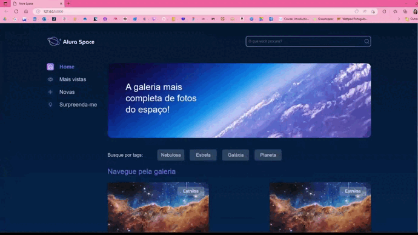

# Projeto Alura Space

Projeto de desenvolvimento web realizado com Django.

| :placard: Vitrine.Dev |     |
| -------------  | --- |
| :sparkles: Nome        | **Projeto Alura Space**
| :label: Tecnologias | HTML5, CSS3, Django, Python
| :rocket: URL         | thamyresmya.github.io/Space_alura/
| :fire: Desafio     | 

<!-- Inserir imagem com a #vitrinedev ao final do link -->

  <a href="#-tecnologias">Tecnologias</a>&nbsp;&nbsp;&nbsp;|&nbsp;&nbsp;&nbsp;  
  <a href="#-projeto">Projeto</a>&nbsp;&nbsp;&nbsp;|&nbsp;&nbsp;&nbsp;  
  <a href="#-gif">Gif</a>&nbsp;&nbsp;&nbsp;&nbsp;&nbsp;&nbsp;

 

## 🚀 Tecnologias

Esse projeto foi desenvolvido com as seguintes tecnologias:

- Python
- Django
- Git e Github

 

## 💻 Projeto

Projeto realizado junto coṁa Alura, para desenvolver e aprimorar conhecimentos sobre Django, templates e boas práticas, renderizações de página no Django, lidar com dados em uma aplicação Django utilizando banco de dados e lidar com arquivos de mídia no Django.

 

## 📸 Gif
Renderizações de página no Django

</img>

Utilização do banco de dados

</img>

 

---

Feito com ♥ by Thamyres Cavalcante.

